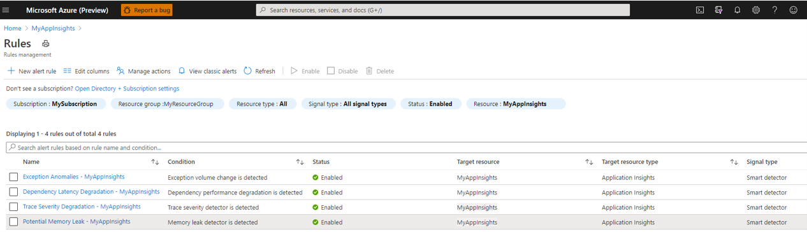

# Migrate Azure Monitor Application Insights Smart Detection to Smart Alerts (Preview) 

This guide will walk you through the process of migrating Application Insights Smart Detection to Smart Alerts.  The migration will create alert rules for the different Smart Alerts detectors. You can manage and configure these rules just like any other Azure Monitor alert rules. You can also configure action groups for these rules, thus enabling multiple methods of taking actions or triggering notification on new detections.

You can access the detections issued by Smart Detection alerts both from the alerts you receive, and from the Smart Detection blade. 

> [!NOTE]
> Migration of Smart Detection to Smart Alerts is currently available for a private, invitation-only preview. If you are interested to participate in the private preview, please contact yagil@microsoft.com

## New capabilities

Alerts-based Smart Detection allows you to take advantage of the full capabilities of Azure Monitor Alerts including:

* Smart Alert rules allow you to conveniently manage your Smart Detection alerts at scale using Azure Monitor alert experience and API.
* [Action groups](https://docs.microsoft.com/azure/azure-monitor/platform/action-groups) allows you to configure multiple types of notifications and actions which will be triggered when an alert is fired. This includes notification by email, SMS, voice call or push notifications, and actions such as secure webhook, Logic App, automation Runbook and more. Action groups further support management at scale by allowing you to configure actions once and use them across multiple alert rules
* [Action Rules](https://docs.microsoft.com/azure/azure-monitor/platform/alerts-action-rules?tabs=portal) help you define or suppress actions at any Azure Resource Manager scope (Azure subscription, resource group, or target resource). They have various filters that help you narrow down the specific subset of alert instances that you want to act on. 

## Supported Detectors 

The following Smart Detection capabilities are converted to alerts by the migration process, each with it's own alert rule:
* Response latency degradation
* Dependency latency degradation
* Trace severity degradation
* Exception anomalies
* Potential memory leak

The following Smart Detection capabilities will not be converted to alerts and will no longer be supported once you complete the migration:
* Slow page load time
* Slow server response time
* Long dependency duration
* Potential security issue detected (preview)
* Abnormal rise in daily data volume (preview)


## New alert rules

For each migrated AI resource, an alert rule is created for each one of the migrated detectors. If your a specific smart detector was disabled before the migration, the created alert rule will be disabled as well. 

The names of the new created alert rules will be the following:
* **Response Latency Degradation - \<target resource name\>**
* **Dependency Latency Degradation - \<target resource name\>**
* **Trace Severity Degradation - \<target resource name\>**
* **Exception Anomalies - \<target resource name\>**
* **Potential Memory Leak - \<target resource name\>**

Where <target resource name> is the name of the migrated Application Insights resource.

To see your new alert rules after the migration is completed:

1. select **Alerts** under the **Monitoring** heading in your Application Insights resource left-side menu.


2. Select **Manage Alert Rules**


3. Select **Signal Type** to be **Smart Detector** in order to filter and present the Smart Detector alert rules.



## Action group configuration
Each new smart alert rule is automatically configured with an action group. The configured action group for each rule depends on the notification configuration for the equivalent smart detector prior to the migration.
* If you didn’t previously change the default notification for the detector, or the detector didn’t have notification at all (preview detectors), the rule will be configured with the “Application Insights Smart Detection” action group. If an action group with that name already exists in this subscription, the existing action group will be used. If an action group with that name does not exist, it will be created with  default “email to ARM role” actions, sending notification to your ARM Monitoring Contributor and Monitoring Reader users.
* If you previously did change the default email notification for the equivalent detector, then an action group called “Application Insights Smart Detection Custom” will be created, with an email action sending notification to the previously configured email addresses.

Note that once the new alert rules are created, you can configure different action groups to the Smart Detection Alert rules. You can also add more actions, modify, or delete the action groups created by the migration.

## Viewing your Smart Detection Alerts
Following the migration process, you can still see the available detections in the Smart Detections feed of your Application Insights resource.


In addition, you can now see view your Smart Detection alerts by selecting the Alerts entry in your Application Insights resource left-side menu. Select **Signal Type** to be **Smart Detector** in order to filter and present only the Smart Detector alert rules. You can select an alert to see its detection details.

![Smart Detection Alerts]/media/alerts-smart-detections-migration/Smart-Detection-Alerts.png)

    
## Migrate your Smart Detection using the Azure portal
You can migrate your Smart Detection to alerts on a specific Application resource at a time. 

To migrate an Application Insights resource Smart Detection to alerts, take the following steps:

1. select **Smart Detection** under the **Investigate** heading in your Application Insights resource left-side menu.

2. Click on the banner reading **"Migrate Smart Detection to Smart Alerts (preview)**. The migration dialog will be opened.


3. Select **Migrate** to start the migration process.


## Programmatic migration

### Azure PowerShell
You can initiate Smart Detection migration to alerts using the following commands.

```powershell
az rest --method POST --uri /subscriptions/{subscriptionId}/providers/Microsoft.AlertsManagement/migrateFromSmartDetections?api-version=2020-11-01 --body @body.txt
```
